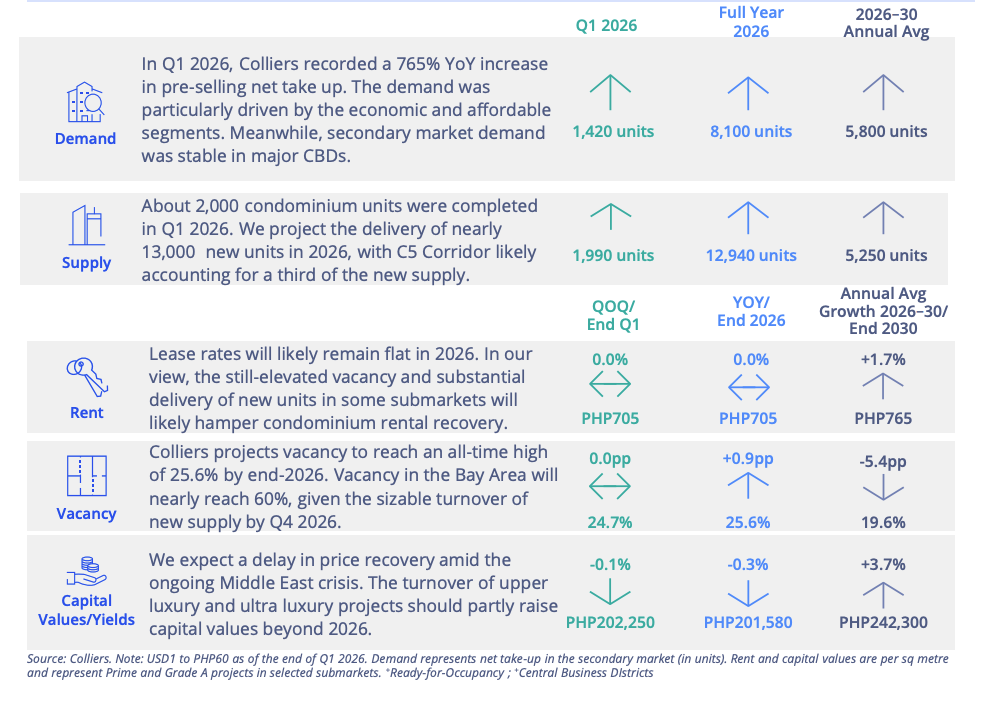
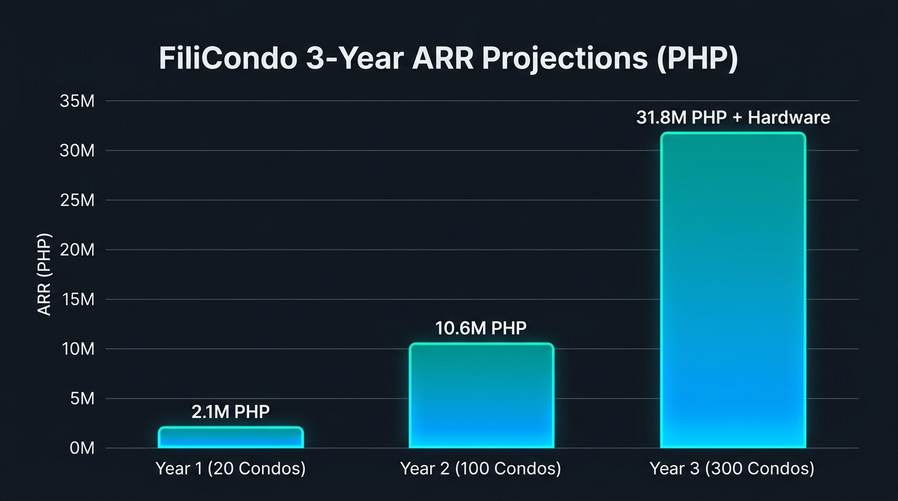

# FiliCondo: Investment Pitch Deck

---

## Slide 1: Cover Page
### **FiliCondo: The Future of Smart Residential Operations**
* **Subtitle**: The AI-Powered All-in-One Property Management Platform for the Philippines' Booming Condominium Market
* **Key Message**: Elevating property value, slashing operational overhead, and delivering a premium, contactless living experience for residents, staff, and administrators.

---

## Slide 2: The Problem
### **The Pain Points of Traditional Condo Management**
* **Administrative Nightmare**: Monthly paper-based billing and manual bank receipt verification waste hundreds of hours and invite billing disputes and fraud.
* **Analog & Unsecure Gates**: Gate logs and parcel deliveries managed with manual pen-and-paper registers create security gaps and resident frustration.
* **Invisible Workforce**: Property managers lack visibility into guard and cleaning staff schedules, leading to payroll leakage and service degradation.

---

## Slide 3: The Solution
### **A Connected, Real-Time Residential Ecosystem**
* **AI-Powered Billings**: Instant invoice generation and distribution, paired with AI-driven bank receipt scanning and automatic reconciliation.
* **Mobile-First Experience**: High-security pre-registered guest passes via QR codes, contactless parcel drop-offs, and transparent maintenance request tracking.
* **Data-Driven Operations**: Location-bound (Geofence) staff check-ins and automatic shift/payroll calculation to ensure full workforce accountability.

---

## Slide 4: The Product Ecosystem
### **Three Interfaces, One Unified Database**
* **For Residents (Mobile App)**:
  * View statements, pay bills via mobile wallets, and upload payment proofs.
  * Register visitors to generate QR passes.
  * Access community bazaar, facility bookings, and local emergency alerts.
* **For Guards & Staff (Mobile App)**:
  * Geofenced check-in/out and duty status logs.
  * Scan guest QR codes and log incoming/outgoing parcels.
* **For Administrators (Web Portal)**:
  * Unified billing ledger with automated penalty accruals and payment matching.
  * Comprehensive visitor, parcel, and maintenance tracking dashboards.

---

## Slide 5: Product Moat & Key Differentiators
### **Why FiliCondo Wins**
* **1. AI-Driven Bank Reconciliation**: Deciphers transaction screenshots and bank logs in real-time, eliminating manual verification and payment spoofing.
* **2. Hardware-Free Access Control**: Provides secure, real-time gate logging via QR codes on mobile devices, completely bypassing expensive IoT installation costs.
* **3. Precision Billing Engine**: Handles partial payments, dynamic late fee accruals, and automatic billing-cycle carryovers out-of-the-box.

---

## Slide 6: Market Opportunity
### **Tapping into the Philippine Condominium Boom**
* **Massive Supply & Demand Growth**:
  * Colliers projects **12,940 new condominium units** to be completed in 2026 alone, with an annual average delivery of **5,250 units** through 2030.
  * Q1 2026 saw a **765% YoY increase** in pre-selling net take-up, proving explosive demand for high-rise residential units.
* **High Vacancy Driving Cost Sensitivity (Why now?)**:
  * Vacancy rates are projected to peak at **25.6% by end-2026**. Condominium corporations face heavy pressure to cut operational expenses (OPEX) to maintain yields.
  * Flat rental rates (PHP 705/sqm) make low-cost, high-efficiency B2B SaaS solutions like FiliCondo essential for PMOs.
* **Serviceable Obtainable Market (SOM)**:
  * Premium condominiums in dense Philippine urban districts (e.g., BGC, Makati, Ortigas) where mobile wallet payment adoption (GCash, Maya) is near 100%.
* **Visual Market Data**:
  

---

## Slide 7: Business Model
### **Highly Scalable, Multi-Stream Revenue Engine**
* **B2B SaaS Subscription**: Recurrent monthly licensing fee billed per unit to the Condominium Corporation or Property Management Office (PMO) for platform access.
* **Direct System & Hardware Sales (Future Expansion)**: Direct sales and supply of specialized hardware-software integration systems down the line, such as smart parking management systems, automated gate security solutions, and physical access control units.
* **Targeted Advertising & Local Sponsorships**: In-app advertising revenue from local merchants and home service providers (e.g., cleaning, laundry, internet installation) targeting residents directly.
* **Value-Added Service Commissions**: Fees from premium amenity bookings and community marketplace transactions, excluding payment transaction fees.

---

## Slide 8: Financial Projections & Milestones
### **Data-Driven Revenue Projections**
* **SaaS Subscription Pricing (Weighted Avg: PHP 3,833/month/condo)**:
  * **Tier 1 (≤ 200 units)**: PHP 3,000 / month / condo (33.3% share)
  * **Tier 2 (201 - 500 units)**: PHP 4,000 / month / condo (50.0% share)
  * **Tier 3 (> 500 units)**: PHP 5,000 / month / condo (16.7% share)
* **Localized Advertising (PHP 5,000/month/condo)**:
  * Based on 5 active advertiser placements per condo at PHP 1,000 / month per condo.
  * (Multi-property bundles: 5 condos for PHP 4,000/month; 10 condos for PHP 7,000/month per advertiser).
* **Total Projected Revenue per Condo**: **PHP 8,833 / month** (approx. USD 150)
* **3-Year ARR (Annual Recurring Revenue) Targets**:
  * **Year 1 (20 Condos)**: **ARR PHP 2,120,000** (approx. USD 36k)
  * **Year 2 (100 Condos)**: **ARR PHP 10,600,000** (approx. USD 181k)
  * **Year 3 (300 Condos)**: **ARR PHP 31,800,000** (approx. USD 543k) + Hardware Direct Sales
* **Visual Projections**:
  

---

## Slide 9: Traction & Validation
### **Proven Operational Success**
* **Rapid Onboarding**: Active pilots and commercial deployments across multiple condominium towers, managing thousands of residential units.
* **Administrative Efficiency**: Reduced staff billing verification time by **over 85%** using our AI payment validation dashboard.
* **Improved Cash Flow**: Average collection speed improved by **30%** within the first two months of deployment due to automated mobile push reminders.
* **High Engagement**: Monthly active app utilization rate exceeds **80%** among residents.

---

## Slide 10: Go-To-Market (GTM) Strategy
### **Our Path to Scale**
* **B2B Partnerships**: Direct integration into the software portfolios of major property management conglomerates.
* **Community Network Effects**: Deploying in cluster locations where adjacent properties naturally request the same system after experiencing it next door.
* **O2O Services Upsell**: Expanding into on-demand services (cleaning, laundry, internet setup) once a strong resident network is established.

---

## Slide 11: Investment Request & Use of Funds
### **Scaling to Dominate the Philippine PropTech Space**
* **Investment Round**: Seed Round — targeting **PHP 12,000,000** (approx. USD 205,000)
* **Use of Proceeds**:
  * **Core Engineering & Platform R&D (40% / PHP 4,800,000)**: Secure 24-month runway for a Lead Korean Software Engineer, and fund scalable cloud infrastructure hosting and integration R&D.
  * **Operations, Legal & Compliance (35% / PHP 4,200,000)**: Fund local SEC incorporation, legal/contract advisory, Data Privacy Act (DPA) security system registration, local on-site training staff, and cybersecurity penetration audits.
  * **Go-To-Market & Growth (25% / PHP 3,000,000)**: Fund aggressive B2B sales outreach, local PMO (Property Management Office) marketing events, and strategic partnerships to accelerate market entry.

---

## Slide 12: Call to Action
### **Partner with FiliCondo**
* *Join us in building the digital infrastructure for modern urban living.*
* **Presenter**: [Founder Name / Title]
* **Contact**: investment@filicondo.com
* **Website**: [www.filicondo.com](http://www.filicondo.com)
